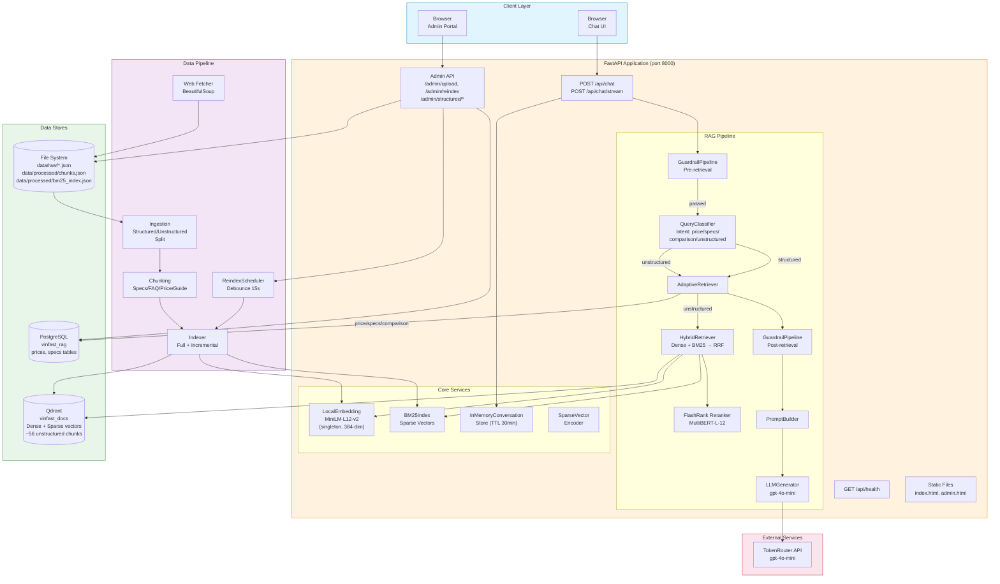
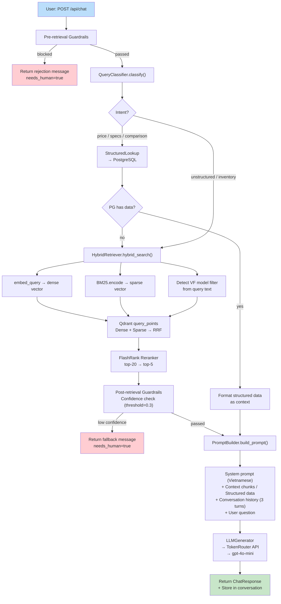
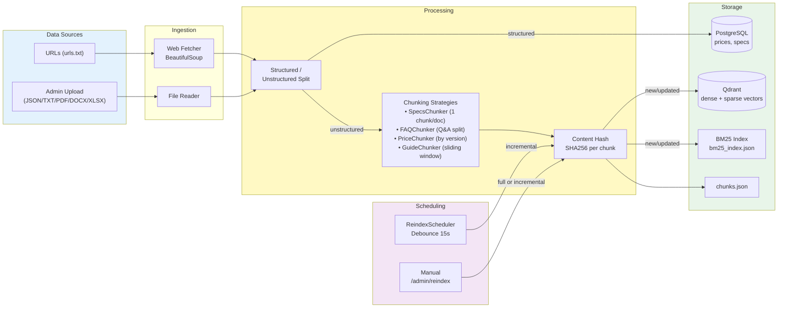
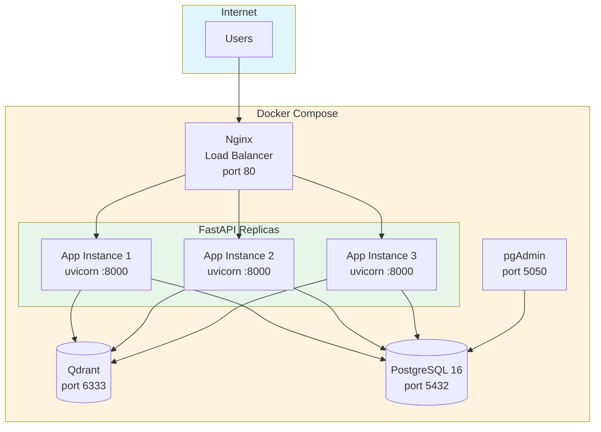

## 4. Tech Stack

### 4.1. Demo hiện tại

| Component | Lựa chọn | RAM |
|---|---|---|
| Backend | Python 3.11 + FastAPI | ~150MB |
| LLM | gpt-4o-mini qua TokenRouter API | 0MB (API) |
| Embedding | paraphrase-multilingual-MiniLM-L12-v2 (sentence-transformers, local) | ~500MB |
| Vector DB | Qdrant (Docker) | ~200MB |
| Structured DB | PostgreSQL 16 (Docker) | ~100MB |
| Hybrid search | Dense + BM25 sparse → Qdrant RRF fusion | — |
| Reranker | FlashRank MultiBERT-L-12 (ONNX, local) | ~500MB |
| Web UI | FastAPI serve HTML/JS | — |
| Admin Portal | FastAPI serve HTML/JS | — |

---

### 4.2. System Architecture



### 4.3. Request Flow (Chat)



### 4.4. Data Pipeline & Indexing



### 4.5. Deployment Architecture (Production)



### 4.6. Component Dependencies

```mermaid
graph LR
    subgraph Core["app/core/"]
        chunking["chunking.py<br/>4 strategies"]
        embedding["embedding.py<br/>LocalEmbedding<br/>(singleton)"]
        retrieval["retrieval.py<br/>HybridRetriever"]
        sparse["sparse.py<br/>BM25Index"]
        reranker["reranker.py<br/>FlashRank"]
        adaptive["adaptive_retrieval.py<br/>AdaptiveRetriever"]
        classifier["query_classifier.py<br/>QueryClassifier"]
        structured["structured_lookup.py<br/>StructuredLookup"]
        guardrails["guardrails.py<br/>3-stage pipeline"]
        prompt["prompt_builder.py"]
        generation["generation.py<br/>LLMGenerator"]
        conversation["conversation.py<br/>InMemoryStore"]
    end

    subgraph Data["app/data/"]
        fetcher["fetcher.py"]
        ingestion["ingestion.py"]
        indexer["indexer.py"]
        reindex["reindex_scheduler.py"]
    end

    subgraph DB["app/db/"]
        connection["connection.py<br/>SQLAlchemy"]
        models["models.py<br/>Price, Spec"]
    end

    adaptive --> classifier
    adaptive --> retrieval
    adaptive --> structured
    retrieval --> embedding
    retrieval --> sparse
    retrieval --> reranker
    structured --> connection
    connection --> models
    indexer --> embedding
    indexer --> sparse
    indexer --> chunking
    ingestion --> chunking
    reindex --> indexer
    fetcher --> ingestion